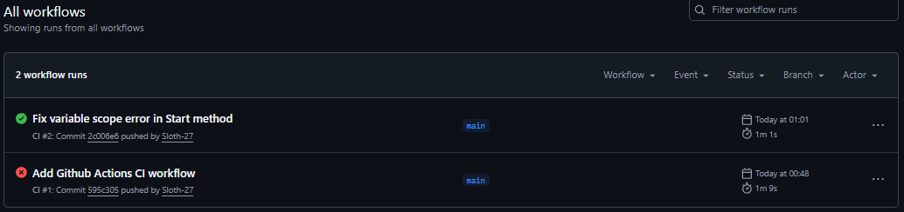

# Cybersecurity Awareness Bot

A console-based chatbot that educates users on cybersecurity topics like phishing and password safety.

## How to run
1. Ensure .NET SDK is installed
2. Run `dotnet run` in the project folder

## CI Status

